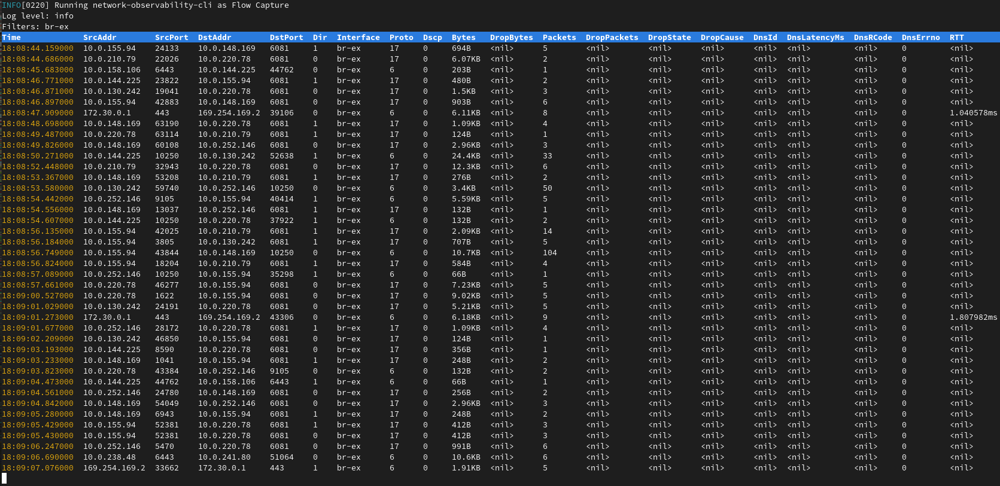
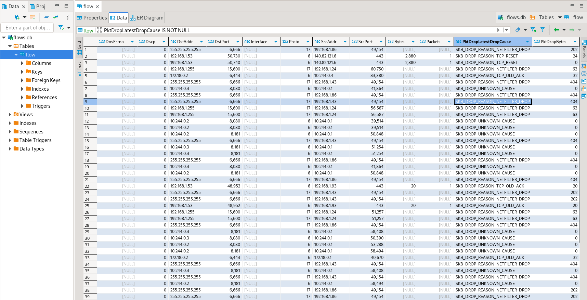
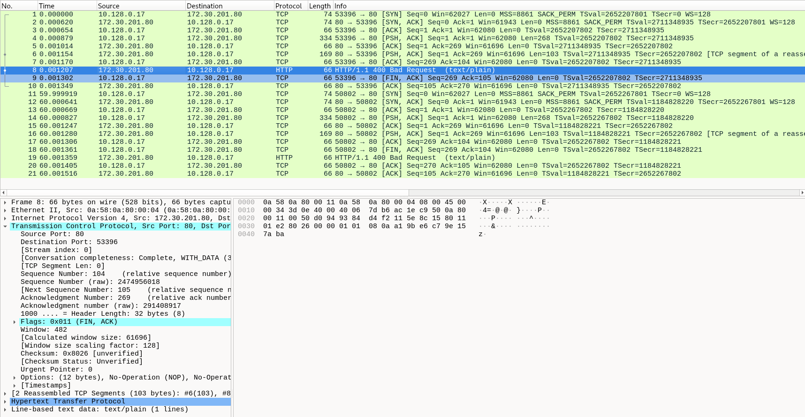
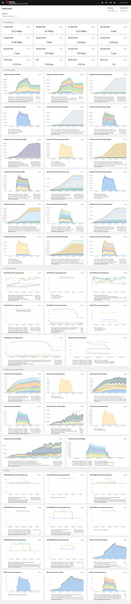

# Network Observability CLI

network-observability-cli is a lightweight Flow, Packet and Metrics visualization tool.
It deploys [NetObserv eBPF agent](https://github.com/netobserv/netobserv-ebpf-agent) on your k8s cluster to collect flows or packets from nodes network interfaces
and streams data to a local collector for analysis and visualization.
Output files are generated under `output/flow` and `output/pcap` directories per host name

On Openshift environments, you can also capture metrics in your monitoring stack and display a fully configured dashboard.

## Prerequisites

To run this CLI, you will need:
- A running kubernetes / OpenShift cluster
- either `oc` or `kubectl` command installed and connected to your cluster
- Cluster admin rights

## Build

To build the project locally:

### Install `shellcheck` package

```bash
sudo dnf install -y shellcheck
```

### Build the project

```bash
make build
```

This will also copy resources and commands to the `build` directory.

### Images

To build your own images of CLI, run the following command replacing `USER` and `VERSION` accordingly:
```bash
USER=netobserv VERSION=dev make images
```

## Run

### Flow Capture

Run the following command to start capturing flows, replacing `USER`, `VERSION` and `COMMAND_ARGS` accordingly:

```bash
USER=netobserv VERSION=dev COMMAND_ARGS=--interfaces=br-ex make flows
```



It will display a table view with latest flows collected and write data under output/flow directory.
To stop capturing press Ctrl-C.

This will write data into two separate files:
- `./output/flow/<CAPTURE_DATE_TIME>.json` containing json array of received data such as:
```json
{
  "AgentIP": "10.0.1.76",
  "Bytes": 561,
  "DnsErrno": 0,
  "Dscp": 20,
  "DstAddr": "f904:ece9:ba63:6ac7:8018:1e5:7130:0",
  "DstMac": "0A:58:0A:80:00:37",
  "DstPort": 9999,
  "Duplicate": false,
  "Etype": 2048,
  "Flags": 16,
  "FlowDirection": 0,
  "IfDirection": 0,
  "Interface": "ens5",
  "K8S_FlowLayer": "infra",
  "Packets": 1,
  "Proto": 6,
  "SrcAddr": "3e06:6c10:6440:2:a80:37:b756:270f",
  "SrcMac": "0A:58:0A:80:00:01",
  "SrcPort": 46934,
  "TimeFlowEndMs": 1709741962111,
  "TimeFlowRttNs": 121000,
  "TimeFlowStartMs": 1709741962111,
  "TimeReceived": 1709741964
}
```
- `./output/flow/<CAPTURE_DATE_TIME>.db` database that can be inspected using `sqlite3` for example: 
```bash
bash-5.1$ sqlite3 ./output/flow/<CAPTURE_DATE_TIME>.db 
SQLite version 3.34.1 2021-01-20 14:10:07
Enter ".help" for usage hints.
sqlite> SELECT DnsLatencyMs, DnsFlagsResponseCode, DnsId, DstAddr, DstPort, Interface, Proto, SrcAddr, SrcPort, Bytes, Packets FROM flow WHERE DnsLatencyMs >10 LIMIT 10;
12|NoError|58747|10.128.0.63|57856||17|172.30.0.10|53|284|1
11|NoError|20486|10.128.0.52|56575||17|169.254.169.254|53|225|1
11|NoError|59544|10.128.0.103|51089||17|172.30.0.10|53|307|1
13|NoError|32519|10.128.0.52|55241||17|169.254.169.254|53|254|1
12|NoError|32519|10.0.0.3|55241||17|169.254.169.254|53|254|1
15|NoError|57673|10.128.0.19|59051||17|172.30.0.10|53|313|1
13|NoError|35652|10.0.0.3|46532||17|169.254.169.254|53|183|1
32|NoError|37326|10.0.0.3|52718||17|169.254.169.254|53|169|1
14|NoError|14530|10.0.0.3|58203||17|169.254.169.254|53|246|1
15|NoError|40548|10.0.0.3|45933||17|169.254.169.254|53|174|1
```
or `dbeaver`:



### Packet Capture

Run the following command to start capturing packets, replacing `USER`, `VERSION` and `COMMAND_ARGS` accordingly:

```bash
USER=netobserv VERSION=dev COMMAND_ARGS="--protocol=TCP --port=80" make packets
```

Similarly to flow capture, it will display a table view with latest flows. However, it will collect packets and write data under output/pcap directory.
To stop capturing press Ctrl-C.

This will write [pcapng](https://wiki.wireshark.org/Development/PcapNg) into a single file located in `./output/pcap/<CAPTURE_DATE_TIME>.pcapng` that can be opened with Wireshark for example:



### Metrics dashboard (OCP only)

Run the following command to start capturing metrics, replacing `USER`, `VERSION` and `COMMAND_ARGS` accordingly:
```bash
USER=netobserv VERSION=dev COMMAND_ARGS='--enable_pktdrop="true" --enable_dns="true" --enable_rtt="true"' make metrics
```



It will generate a monitoring dashboard called "NetObserv / On Demand" in your Openshift cluster.
The url to access it is automatically generated from the CLI. Simply click on the link to open the page.

### Cleanup

The `cleanup` function will automatically remove the eBPF programs when the CLI exits. However you may need to run it manually if running in background or an error occurs.

```bash
USER=netobserv VERSION=dev make cleanup
```

## Extending OpenShift or Kubernetes CLI with plugins

You can add this plugin to your favorite `oc` or `kubectl` commands using the following steps:

```bash
K8S_CLI_BIN=oc make install-commands
```
OR 
```bash
K8S_CLI_BIN=kubectl make install-commands
```

This will add `netobserv` commands to your CLI.
You can verify the commands are available using:

```bash
oc plugin list
```
OR
```bash
kubectl plugin list
```

It will display as result:

```bash
The following compatible plugins are available:
...
/usr/bin/<oc|kubectl>-netobserv
```

More info [on official OpenShift documentation](https://docs.openshift.com/container-platform/4.14/cli_reference/openshift_cli/extending-cli-plugins.html).
