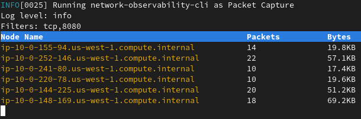

# Network Observability CLI

network-observability-cli is a lightweight Flow and Packet visualization tool.
It deploys [NetObserv eBPF agent](https://github.com/netobserv/netobserv-ebpf-agent) on your k8s cluster to collect flows or packets from nodes network interfaces
and streams data to a local collector for analysis and visualization.
Output files are generated under `output/flow` and `output/pcap` directories per host name

## Work In Progress

This project is still a WIP. The following list gives an overview of the current progression:

- [x] Capture flows
- [x] Capture packets
- [x] Basic filter capabilities
- [ ] Advanced filter capabilities
- [ ] Testing
- [ ] Linting
- [ ] Dockerfile
- [ ] Allow switching between `kubectl` / `oc` commands

Feel free to contribute !

## Prerequisites

To run this CLI, you will need:
- A running kubernetes / OpenShift cluster
- `oc` command installed and connected
- Cluster admin rights

## Build

To build the project locally:

### Install `shellcheck` package

```bash
sudo dnf install -y shellcheck
```

### Build the project

```bash
make build
```

This will also copy resources and oc commands to the `build` directory.

## Run

### Flow Capture

Simply run the following command to start capturing flows:

```bash
./oc/oc-netobserv-flows
```


It will display a table view with latest flows collected and write data under output/flow directory.
To stop capturing press Ctrl-C.

### Packet Capture

PCAP generated files are compatible with Wireshark

```bash
./oc/oc-netobserv-packets <filters>
```

For example:

```bash
./oc/oc-netobserv-packets "tcp,8080"
```



It will display a table view with latest packets collected and write data under output/pcap directory.
To stop capturing press Ctrl-C.

### FLow Capture and write to Sqlite database

```bash
./oc/oc-netobserv-flows-db
```

This will write flows to `flows.db` file and it can be inspected using `sqlite3` for example 

```bash
$ oc exec -it -n netobserv-cli collector -- bash
bash-5.1$ sqlite3 flows.db 
SQLite version 3.34.1 2021-01-20 14:10:07
Enter ".help" for usage hints.
sqlite> SELECT DnsLatencyMs, DnsFlagsResponseCode, DnsId, DstAddr, DstPort, Interface, Proto, SrcAddr, SrcPort, Bytes, Packets FROM flow WHERE DnsLatencyMs >10 LIMIT 10;
12|NoError|58747|10.128.0.63|57856||17|172.30.0.10|53|284|1
11|NoError|20486|10.128.0.52|56575||17|169.254.169.254|53|225|1
11|NoError|59544|10.128.0.103|51089||17|172.30.0.10|53|307|1
13|NoError|32519|10.128.0.52|55241||17|169.254.169.254|53|254|1
12|NoError|32519|10.0.0.3|55241||17|169.254.169.254|53|254|1
15|NoError|57673|10.128.0.19|59051||17|172.30.0.10|53|313|1
13|NoError|35652|10.0.0.3|46532||17|169.254.169.254|53|183|1
32|NoError|37326|10.0.0.3|52718||17|169.254.169.254|53|169|1
14|NoError|14530|10.0.0.3|58203||17|169.254.169.254|53|246|1
15|NoError|40548|10.0.0.3|45933||17|169.254.169.254|53|174|1
sqlite> .exit
bash-5.1$ 

```
### Cleanup

The `cleanup` function will automatically remove the eBPF programs when the CLI exits. However you may need to run it manually if an error occurs.

```bash
./oc/oc-netobserv-cleanup
```

## Extending OpenShift CLI with plugin

You can add this plugin to your favorite oc commands using the following steps:

```bash
make oc-commands
```

This will add `oc netobserv flows` and `oc netobserv packets` commands to your CLI.
You can verify the commands are available using:

```bash
oc plugin list
```

It will display as result:

```
The following compatible plugins are available:
...
/usr/bin/oc-netobserv-cleanup
/usr/bin/oc-netobserv-flows
/usr/bin/oc-netobserv-packets
```

More info [on official OpenShift documentation](https://docs.openshift.com/container-platform/4.14/cli_reference/openshift_cli/extending-cli-plugins.html).
