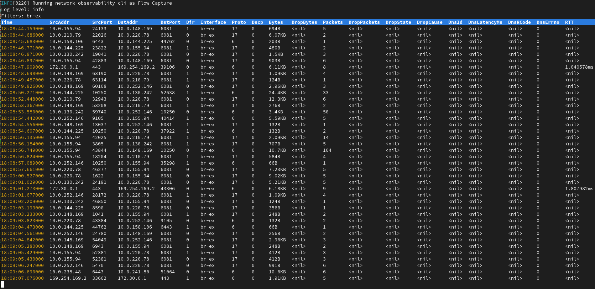
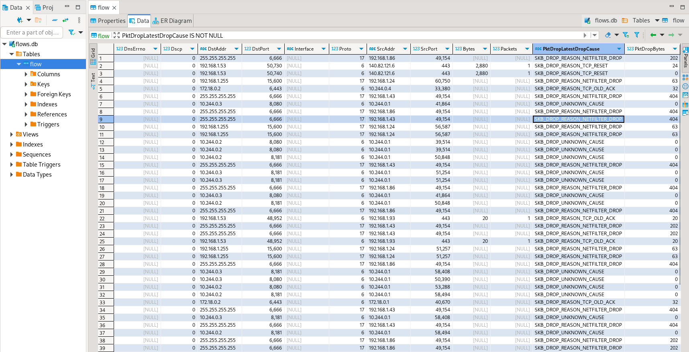
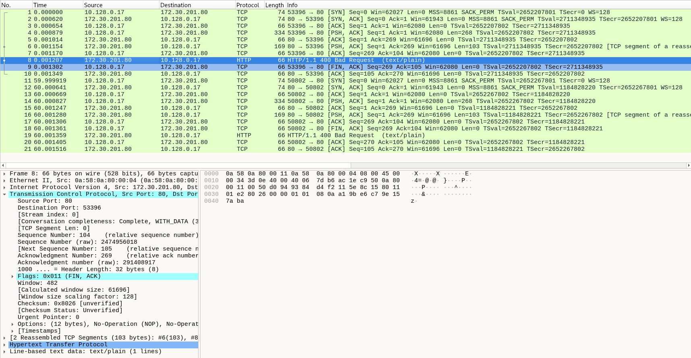
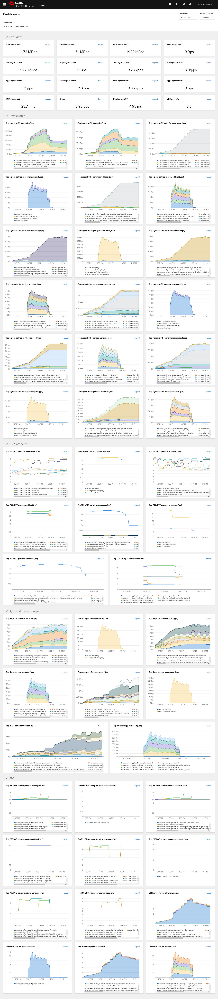

# Network Observability CLI

network-observability-cli is a lightweight Flow, Packet and Metrics visualization tool.
It deploys [NetObserv eBPF agent](https://github.com/netobserv/netobserv-ebpf-agent) on your k8s cluster to collect flows or packets from nodes network interfaces
and streams data to a local collector for analysis and visualization.
Output files are generated under `output/flow` and `output/pcap` directories per host name.

On Openshift environments, you can also capture metrics in your monitoring stack and display a fully configured dashboard.

## Prerequisites

To run this CLI, you will need:
- A running kubernetes / OpenShift cluster
- either `oc` or `kubectl` command installed and connected to your cluster
- Cluster admin rights

## Getting started with Krew

The CLI is available as a [Krew](https://krew.sigs.k8s.io/) plugin, which is the fastest way to get it up and running if you already use Krew.
If not, please refer to its [installation guide](https://krew.sigs.k8s.io/docs/user-guide/setup/install/).

To install the NetObserv CLI, run:

```bash
kubectl krew install netobserv
```

Or if you had an older version, to update it:

```bash
kubectl krew update netobserv
```

Then, run it as a `kubectl` plugin, such as:

```bash
kubectl netobserv --version
# output example: 
# NetObserv CLI version v0.0.8
```

You can get detailed help using these commands:

```bash
kubectl netobserv --help
kubectl netobserv flows --help
kubectl netobserv packets --help
kubectl netobserv metrics --help
```

## Run

### Flow Capture

For instance, to capture all flows on the cluster that go through the `br-ex` network interface:

- As a `kubectl` plugin:

  ```bash
  kubectl netobserv flows --interfaces=br-ex
  ```

- Or from the repository `Makefile`:

  Run the following command to start capturing flows, replacing `USER`, `VERSION` and `COMMAND_ARGS` accordingly:

  ```bash
  USER=netobserv VERSION=dev COMMAND_ARGS=--interfaces=br-ex make flows
  ```



It will display a table view with latest flows collected and write data under output/flow directory.
To stop capturing press Ctrl-C.

This will write data into two separate files:
- `./output/flow/<CAPTURE_DATE_TIME>.json` containing json array of received data such as:
```json
{
  "AgentIP": "10.0.1.76",
  "Bytes": 561,
  "DnsErrno": 0,
  "Dscp": 20,
  "DstAddr": "f904:ece9:ba63:6ac7:8018:1e5:7130:0",
  "DstMac": "0A:58:0A:80:00:37",
  "DstPort": 9999,
  "Duplicate": false,
  "Etype": 2048,
  "Flags": 16,
  "FlowDirection": 0,
  "IfDirection": 0,
  "Interface": "ens5",
  "K8S_FlowLayer": "infra",
  "Packets": 1,
  "Proto": 6,
  "SrcAddr": "3e06:6c10:6440:2:a80:37:b756:270f",
  "SrcMac": "0A:58:0A:80:00:01",
  "SrcPort": 46934,
  "TimeFlowEndMs": 1709741962111,
  "TimeFlowRttNs": 121000,
  "TimeFlowStartMs": 1709741962111,
  "TimeReceived": 1709741964
}
```
- `./output/flow/<CAPTURE_DATE_TIME>.db` database that can be inspected using `sqlite3` for example: 
```bash
bash-5.1$ sqlite3 ./output/flow/<CAPTURE_DATE_TIME>.db 
SQLite version 3.34.1 2021-01-20 14:10:07
Enter ".help" for usage hints.
sqlite> SELECT DnsLatencyMs, DnsFlagsResponseCode, DnsId, DstAddr, DstPort, Interface, Proto, SrcAddr, SrcPort, Bytes, Packets FROM flow WHERE DnsLatencyMs >10 LIMIT 10;
12|NoError|58747|10.128.0.63|57856||17|172.30.0.10|53|284|1
11|NoError|20486|10.128.0.52|56575||17|169.254.169.254|53|225|1
11|NoError|59544|10.128.0.103|51089||17|172.30.0.10|53|307|1
13|NoError|32519|10.128.0.52|55241||17|169.254.169.254|53|254|1
12|NoError|32519|10.0.0.3|55241||17|169.254.169.254|53|254|1
15|NoError|57673|10.128.0.19|59051||17|172.30.0.10|53|313|1
13|NoError|35652|10.0.0.3|46532||17|169.254.169.254|53|183|1
32|NoError|37326|10.0.0.3|52718||17|169.254.169.254|53|169|1
14|NoError|14530|10.0.0.3|58203||17|169.254.169.254|53|246|1
15|NoError|40548|10.0.0.3|45933||17|169.254.169.254|53|174|1
```
or `dbeaver`:


### Local output formats

By default, flow capture writes **JSON + SQLite** under `output/flow/` (`--format=json,sqlite`). Parquet is **not** written unless you include `parquet` in `--format`.

`--format` is a **non-exclusive** list (comma-separated and/or repeatable):

| Flag | Writes |
|------|--------|
| _(omitted)_ / `--format=json,sqlite` | JSON + SQLite (default) |
| `--format=parquet` | Parquet only |
| `--format=json,parquet` | JSON + Parquet |
| `--format=json,sqlite,parquet` | all three |
| `--format=json --format=parquet` | same as `json,parquet` |

Invalid tokens fail with a clear error. Hive-partitioned Parquet (schema v1, metadata `netobserv.parquet.version = 1`) lands at:

```text
./output/flow/<CAPTURE_DATE_TIME>/cluster_id=cli/year=YYYY/month=MM/day=DD/hour=HH/part-cli-….parquet
```

**Important:** the collector runs **inside a cluster pod** (`kubectl run` / `oc run`), not as your host binary. Host `./output/flow/` stays empty until files are copied from the pod (same `--copy` prompt as other formats; use `--copy=true` / `--copy=false` to skip the prompt). You must run a **collector image that includes parquet support** (rebuild/push your own tag — `quay.io/netobserv/network-observability-cli:main` will not have unreleased changes):

```bash
IMAGE_ORG=<you> VERSION=dev make image-build
# push/manifest as needed, then:
NETOBSERV_COLLECTOR_IMAGE=quay.io/<you>/network-observability-cli:dev \
  kubectl netobserv flows --format=parquet
```

During capture, `Capture size` tracks inbound flow bytes in memory for the TUI. Parquet parts are flushed every ~2s and again on exit.

```bash
# Default: JSON + SQLite only (no parquet)
kubectl netobserv flows

# Parquet only:
kubectl netobserv flows --format=parquet

# JSON + Parquet, plus optional S3 export:
kubectl netobserv flows --format=json,parquet \
  --s3-endpoint=https://s3.example.com \
  --s3-bucket=<bucket> \
  --s3-account=<account>
```

Example with DuckDB:

```bash
duckdb -c "SELECT SrcK8S_Namespace, sum(Bytes) FROM read_parquet('output/flow/**/*.parquet') GROUP BY 1 ORDER BY 2 DESC LIMIT 20;"
```

### S3 Parquet export (optional)

In addition to local sinks under `output/flow/`, you can opt in to export the same enriched flows as **Hive-partitioned Parquet** to any S3-compatible store. This uses the embedded agent FLP `encode.s3` stage (`format: parquet`), matching the NetObserv operator / console layout:

```text
s3://<bucket>/<prefix>/cluster_id=<account>/year=YYYY/month=MM/day=DD/hour=HH/part-….parquet
```

**Credentials:** do not pass secret keys as CLI flags (shell history / `ps`). Prefer environment variables, or a credentials file / Kubernetes Secret.

```bash
export NETOBSERV_S3_ACCESS_KEY=<access-key>
export NETOBSERV_S3_SECRET_KEY=<secret-key>

kubectl netobserv flows \
  --s3-endpoint=https://s3.example.com \
  --s3-bucket=<bucket> \
  --s3-account=<account> \
  --s3-prefix=netobserv

# Or AWS-style env names:
# export AWS_ACCESS_KEY_ID=<access-key> AWS_SECRET_ACCESS_KEY=<secret-key>

# Or a credentials file (YAML/JSON with accessKeyId/secretAccessKey, or AWS shared credentials):
# kubectl netobserv flows --s3-endpoint=... --s3-bucket=... --s3-credentials-file=./s3-creds.yaml

# Or a Secret already in the CLI namespace (keys: accessKeyId, secretAccessKey):
# kubectl netobserv flows --s3-endpoint=... --s3-bucket=... --s3-secret=netobserv-s3-creds
```

Local JSON/SQLite capture stays enabled by default (`--format=json,sqlite`); S3 is an additional sink independent of local `--format`. Include `parquet` in `--format` for local Parquet.

S3 is configured on the **agent** DaemonSet via `FLP_CONFIG` (direct-flp `encode.s3`), not as collector `--options`. Missing credentials fail the CLI before deploy. Default flush interval is `15s` (capped by `--max-time`); agents also flush pending Parquet parts on SIGTERM. Use an agent image with FLP S3 Parquet support, e.g.:

```bash
export NETOBSERV_AGENT_IMAGE=quay.io/jpinsonn/netobserv-ebpf-agent:s3-flowbuffer
export NETOBSERV_COLLECTOR_IMAGE=quay.io/jpinsonn/network-observability-cli:s3-flowbuffer
```

### Packet Capture

For instance, to capture all TCP packets on the cluster that go through port 80:

- As a `kubectl` plugin:

  ```bash
  kubectl netobserv packets --protocol=TCP --port=80
  ```

- Or from the repository `Makefile`:

  Run the following command to start capturing packets, replacing `USER`, `VERSION` and `COMMAND_ARGS` accordingly:

  ```bash
  USER=netobserv VERSION=dev COMMAND_ARGS="--protocol=TCP --port=80" make packets
  ```

Similarly to flow capture, it will display a table view with latest flows. However, it will collect packets and write data under output/pcap directory.
To stop capturing press Ctrl-C.

This will write [pcapng](https://wiki.wireshark.org/Development/PcapNg) into a single file located in `./output/pcap/<CAPTURE_DATE_TIME>.pcapng` that can be opened with Wireshark for example:



We use the pcapng format to add contextual metadata, such as the k8s pods and service names.

### Metrics dashboard (OpenShift only)

For instance, to capture many available metrics, including Packet drops, DNS stats and latenties:

- As a `kubectl` plugin:

  ```bash
  kubectl netobserv metrics --enable_pkt_drop --enable_dns --enable_rtt
  ```

- Or from the repository `Makefile`:

  Run the following command to start capturing metrics, replacing `USER`, `VERSION` and `COMMAND_ARGS` accordingly:

  ```bash
  USER=netobserv VERSION=dev COMMAND_ARGS='--enable_pkt_drop --enable_dns --enable_rtt' make metrics
  ```



It will generate a monitoring dashboard called "NetObserv / On Demand" in your Openshift cluster.
The url to access it is automatically generated from the CLI. Simply click on the link to open the page.

### Cleanup

The `cleanup` function will automatically remove the eBPF programs when the CLI exits. However you may need to run it manually if running in background or an error occurs.

- As a `kubectl` plugin:

  ```bash
  kubectl netobserv cleanup
  ```

- Or from the repository `Makefile`:

  ```bash
  USER=netobserv VERSION=dev make cleanup
  ```

## Build

To build the project locally:

### Install `shellcheck` package

```bash
sudo dnf install -y shellcheck
```

### Build the project

```bash
make build
```

This will also copy resources and commands to the `build` directory.

### Images

To build your own images of CLI, run the following command replacing `USER` and `VERSION` accordingly:
```bash
USER=netobserv VERSION=dev make images
```

## Extending OpenShift or Kubernetes CLI with plugins

You can add this plugin to your favorite `oc` or `kubectl` commands using the following steps:

```bash
K8S_CLI_BIN=oc make install-commands
```
OR 
```bash
K8S_CLI_BIN=kubectl make install-commands
```

This will add `netobserv` commands to your CLI.
You can verify the commands are available using:

```bash
oc plugin list
```
OR
```bash
kubectl plugin list
```

It will display as result:

```bash
The following compatible plugins are available:
...
/usr/bin/<oc|kubectl>-netobserv
```

More info [on official OpenShift documentation](https://docs.openshift.com/container-platform/4.14/cli_reference/openshift_cli/extending-cli-plugins.html).
